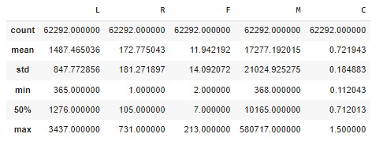

### source: 
(https://www.programmersought.com/article/48113472881/)

(https://www.kaggle.com/code/gilangpanduparase/air-line-customer-segmentation/notebook)


# Airline_Customer_Segmentation
Used airline customer data to classify customers, analyze characteristics of different customer categories, compare customer values ​​of different customer categories, provide personalized services to customer categories of different values, and formulate Corresponding marketing strategy. Data description: This data contains the basic information, flight information and point information of 62,988 customers. It contains the membership card number, membership time, gender, age, membership card level, and the mileage in the observation window.

<!-- ABOUT THE PROJECT -->
## 1. Import Library

  ```sh
import warnings
warnings.filterwarnings('ignore')

import numpy as np
import pandas as pd
import seaborn as sns
import matplotlib.pyplot as plt
%matplotlib inline
import datetime as dt
from sklearn.cluster import KMeans
  ```
## 2. Import Dataset

```sh
df= pd.read_csv("/content/flight.csv")
df
```


## 3. Describe

```sh
explore = df.describe(percentiles = [], include = 'all').T 
# Obtain the number of null record
explore['null'] = len(df) - explore['count'] 
# Return the number of missing value, min and max
explore = explore[['null','min','max']] 
```
```sh
explorer
```


## 4. Data Preprocessing
## Cleaning data to filter unqualified data:

```sh
# Keep instances that ticket price is not null 
clean = df[df['SUM_YR_1'].notnull() & df['SUM_YR_2'].notnull()] 
# Keep instances that ticket price is not 0  OR  average discount is not 0 (100% off)
index1 = clean['SUM_YR_1'] != 0
index2 = clean['SUM_YR_2'] != 0
index3 = clean['avg_discount'] != 0
clean = clean[index1 | index2 | index3]
```
```sh
clean.head()
```

## 5. Reducing features to select necessary factor for RFM model:

```sh
reduce = clean[['LOAD_TIME', 'FFP_DATE', 'LAST_TO_END', 'FLIGHT_COUNT', 'SEG_KM_SUM', 'avg_discount']]
reduce.head()
```

## 6. Transforming data to obtain fit data:

```sh
pd.options.mode.chained_assignment = None  # default='warn'
reduce['LOAD_TIME'] = pd.to_datetime(reduce['LOAD_TIME'])
reduce['FFP_DATE'] = pd.to_datetime(reduce['FFP_DATE'])
reduce['L'] = reduce['LOAD_TIME'] - reduce['FFP_DATE']
reduce['L'] = reduce['L'].dt.days
```
```sh
air_data = reduce[['L', 'LAST_TO_END', 'FLIGHT_COUNT', 'SEG_KM_SUM', 'avg_discount']]
air_data.columns = ['L','R','F','M','C']
air_datadrop = air_data
```
```sh
air_datadrop.head()
```


## 7. Summary

```sh
air_data_summary = air_datadrop.describe(percentiles = [], include = 'all')
air_data_summary
```


## 8. handle outlier

```sh
LRFM=['L','R','F','M','C']
def dist_list(lst):
    plt.figure(figsize=[len(lst)*5,4])
    i = 1
    for col in lst:
        ax = plt.subplot(1,len(lst),i)
        sns.boxplot(air_datadrop[col])
        plt.title(col)
        i = i+1     
dist_list(LRFM)
```

```sh
rfm_log=air_datadrop.copy()
```
```sh
cols=['R','F','M','C']
for col in cols:
    high_cut = rfm_log[col].quantile(q=0.99)
    low_cut=rfm_log[col].quantile(q=0.01)
    rfm_log.loc[rfm_log[col]>high_cut,col]=high_cut
    rfm_log.loc[rfm_log[col]<low_cut,col]=low_cut
```
```sh
LRFM=['L','R','F','M','C']
def dist_list(lst):
    plt.figure(figsize=[len(lst)*5,4])
    i = 1
    for col in lst:
        ax = plt.subplot(1,len(lst),i)
        sns.boxplot(rfm_log[col])
        plt.title(col)
        i = i+1
        
dist_list(LRFM)
```

## 9. Scalling

```sh
from sklearn.preprocessing import MinMaxScaler

df_std=rfm_log
scale = MinMaxScaler()
kolom_all = [x for x in df_std.columns]
for kolom in kolom_all:
  df_std[kolom] = scale.fit_transform(np.array(df_std[kolom]).reshape(-1,1))
  
df_std.head()
```

## 10. #Inertias\Elbow

```sh
from sklearn.cluster import KMeans
ks = range(1,11)
inertias=[]
for k in ks :
    kc = KMeans(n_clusters=k,random_state=142)
    kc.fit(df_std)
    cluster = kc.fit_predict(df_std)
    inertias.append(kc.inertia_)
# Plot ks vs inertias
f, ax = plt.subplots(figsize=(10, 6))
plt.plot(ks, inertias, '-o')
plt.xlabel('Number of clusters, k')
plt.ylabel('Inertia')
plt.xticks(ks)
plt.style.use('ggplot')
plt.title('What is the Best Number for KMeans ?')
plt.show()
```

## 11. silhouette

```sh
from sklearn.metrics import silhouette_score
for n_clusters in range(2,6):
    clusterer = KMeans(n_clusters=n_clusters,init='k-means++',max_iter=300, random_state=142).fit(df_std)
    preds = clusterer.predict(df_std)

    # TODO: Calculate the mean silhouette coefficient for the number of clusters chosen
    score = silhouette_score(df_std, preds, metric='mahalanobis')
    print ("For n_clusters = {}. The average silhouette_score is : {}".format(n_clusters, score))
```

## 12. Clustering

```sh
kc = KMeans(init='k-means++',n_clusters= 4, random_state=142)
kc.fit(df_std)
cluster_labels = kc.labels_

data_c = df_std.assign(K_Cluster = cluster_labels)
data_label=air_data.assign(K_Cluster = cluster_labels)
data_f=data_c.groupby('K_Cluster').mean()
data_f['count']=pd.value_counts(data_c['K_Cluster'])
data_f
```

## 13. PCA

```sh
x=data_c.drop('K_Cluster', axis=1)
#kmeans
from sklearn.cluster import KMeans
from sklearn.decomposition import PCA
n_clusters = 4
sklearn_pca = PCA(n_components = 2)
Y_sklearn = sklearn_pca.fit_transform(df_std)
kmeans = KMeans(n_clusters= n_clusters, max_iter=600,random_state=150, algorithm = 'auto')

%time fitted = kmeans.fit(Y_sklearn)
prediction = kmeans.predict(Y_sklearn)
df_pred=air_data.assign(K_Cluster = prediction)
targets = [0, 1, 2,3]
plt.figure(figsize = (10,8))
plt.scatter(Y_sklearn[:, 0], Y_sklearn[:, 1],c=prediction ,s=50, cmap='viridis')
centers2 = fitted.cluster_centers_
plt.scatter(centers2[:, 0], centers2[:, 1],c='red', s=300, alpha=0.6);
```
## 14. Labeling
```sh
data_labeling=air_data.assign(K_Cluster = cluster_labels)

cluster = [] #membuat list kosong
for i, k in data_labeling.iterrows(): #iterasi setiap row
    if k['K_Cluster'] == 0:
        cluster_name = 'Potential'
    elif k['K_Cluster'] == 3:
        cluster_name = 'Loyal'
    elif k['K_Cluster'] == 1:
        cluster_name = 'Important'
    else:
        cluster_name = 'Low Value'
    cluster.append(cluster_name)
    
data_labeling['cluster'] = cluster #membuat kolom dari list
data_label['cluster'] = cluster #membuat kolom dari list
df_me=data_label.groupby(data_label['cluster']).mean()
df_me['count']=pd.value_counts(data_label['cluster'])
df_me
```


## 15. Model Insight
```sh
LRFM=['L','R','F','M','C']
def dist_list(lst):
    plt.figure(figsize=[len(lst)*5,2])
    i = 1
    cl = ['bgrcmykw'[c] for c in range(len('bgrcmykw'))]
    for col in lst:
        ax = plt.subplot(1,len(lst),i)
        g = data_c.groupby('K_Cluster')
        x = g[col].mean().index
        y = g[col].mean().values
        ax.barh(x,y,color=cl[i-1])
        plt.title(col)
        i = i+1
        
dist_list(LRFM)
```

